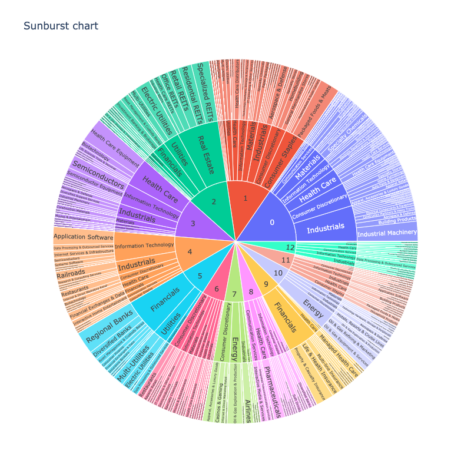

Tutorials
=========

.. include:: _links.rst

Clustering
----------

For getting started, we recommend Quanp’s implementations for S&P500 member companies that 
contain preprocessing, clustering and the identification of features that defined a 
group/cluster of companies.

[2020 Aug] `CharacterisingCompaniesBasedOnFinancialMetricsDuringCovid19`_   
| Medium Post is also available at https://medium.com/analytics-vidhya/characterising-companies-based-on-financial-metrics-during-covid19-1a6ce9cc4ada

[2020 Dec] `CharacterizingOutperformedCompanies1MonthPostCOVID19VaccineSuccess`_    
| Medium Post is also available at https://quantitative-python.medium.com/characterizing-outperformed-companies-1-month-post-covid19-vaccine-success-d03185e167a9

.. image:: _static/img/labeled_leiden_sp500.png
   :width: 100px
.. image:: _static/img/leiden_SP500_currentRatio.png
   :width: 100px
.. image:: _static/img/matrixplot.png
   :width: 200px  
.. image:: _static/img/rank_feature_groups_heatmap.png
   :width: 200px

Factor Analysis
---------------

This tutorial analysed and visualized the underlying features that explain each principle component/factor 
extracted from the S&P500 member companies.  

[2020 Sep] `FactorAnalysisForCompaniesBasedOnFinancialMetricsDuringCovid19`_    
| Medium Post is also available at https://medium.com/swlh/factor-analysis-characterising-companies-based-on-financial-metrics-3d5fcc4e8b6f

.. image:: _static/img/screeplot_varianceratio.png
   :width: 100px
.. image:: _static/img/fa_loading_matrixplot.png
   :width: 200px
.. image:: _static/img/fa_corr_matrix.png
   :width: 200px

