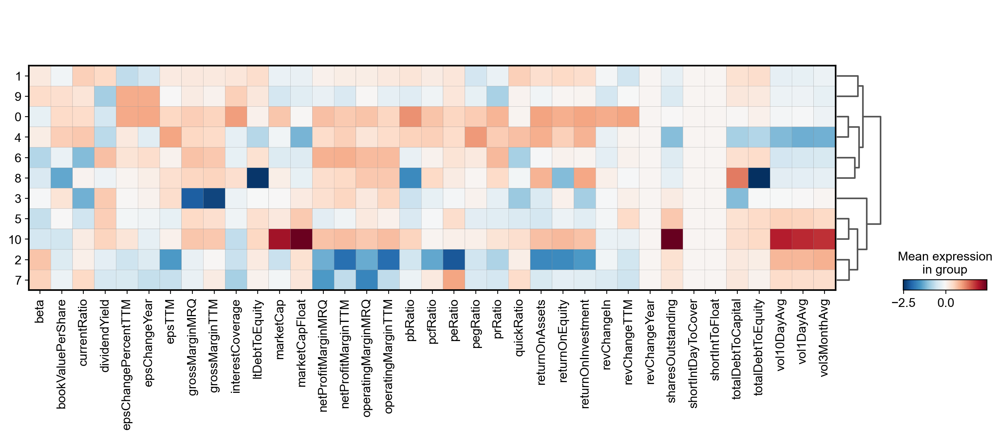

Tutorials
=========

.. include:: _links.rst

Clustering
----------

For getting started, we recommend Quanp’s implementation `CharacterisingCompaniesBasedOnFinancialMetricsDuringCovid19`_
for S&P500 member companies, containing preprocessing, clustering and 
the identification of features that defined a group/cluster of companies.

.. image:: _static/img/labeled_leiden_sp500.png
   :width: 100px
.. image:: _static/img/leiden_SP500_currentRatio.png
   :width: 100px

Factor Analysis
-------------

This tutorial shows analyse and visualize the underlying features in each principle 
component/factor. 

